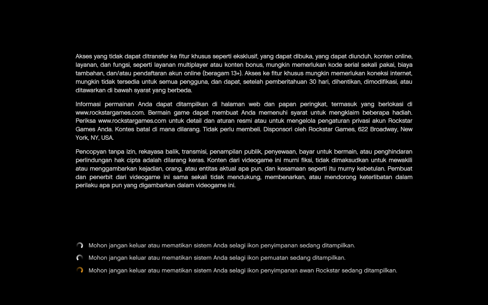
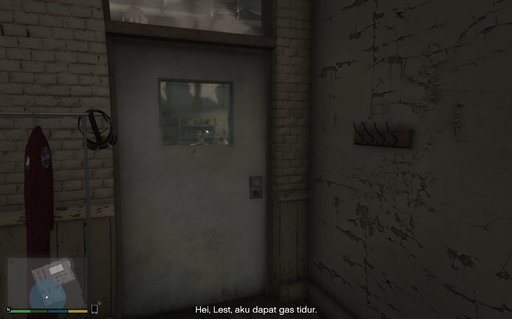
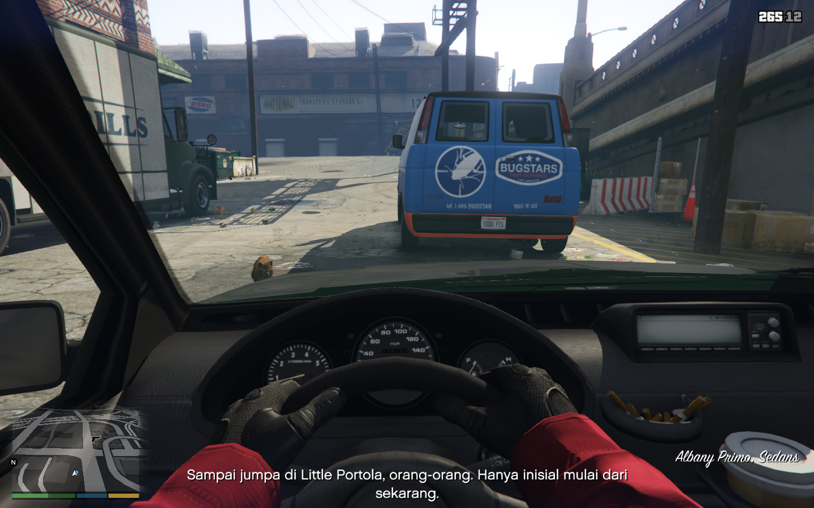

# GTA V Bahasa Indonesia Translation Project

Welcome to the GTA V Bahasa Indonesia Translation Project. This project aims to translate the vast world of GTA V into Bahasa Indonesia, making it more accessible and enjoyable for Indonesian speakers. Currently, the project is in its early stages

## Installation

To install the partial translation into your game, you will need to use OpenIV, a multi-purpose editor and archive manager for PC versions of Grand Theft Auto V, GTA IV/EFLC, and Max Payne 3.

### Steps:

1. Download the latest version of the mod from the [Releases](https://github.com/ElaXan/GTA-V-Bahasa-Indonesia/releases/latest) page.
2. Download and install OpenIV from [the official website](https://openiv.com/).
3. Run OpenIV and select GTA V for Windows.
4. Click `Tools > ASI Manager` and ensure the ASI Loader and OpenIV.ASI are installed.
5. Drag the downloaded `.oiv` file directly into the OpenIV window to start the installation process.
6. Follow the prompts in OpenIV to complete the installation of the mod.
7. Close OpenIV and start your game. The translation should now be applied.

## Screenshot

